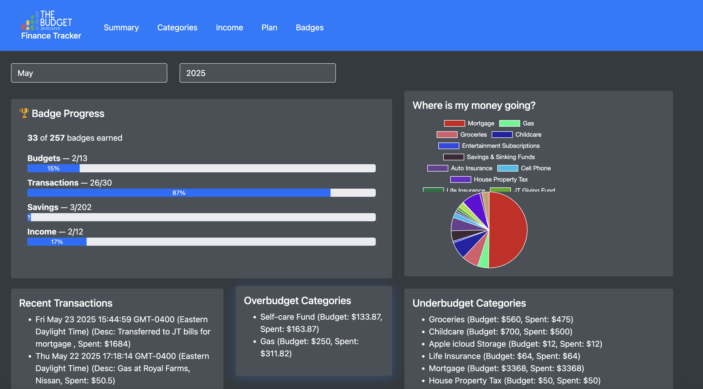
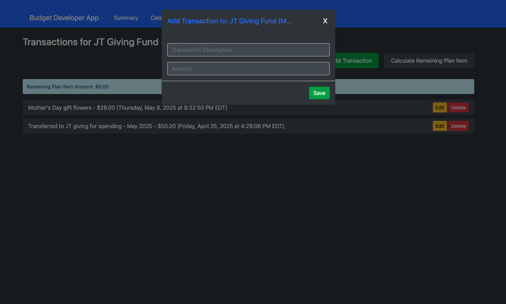
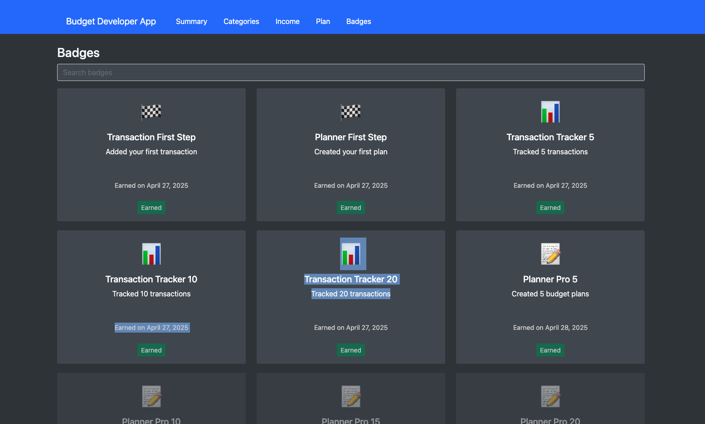

# 💰 The Budget Developer Finance Tracker

An interactive, free-to-use budgeting tool powered by Google Sheets and Google Apps Script. Designed to give you clarity, control, and complete ownership of your finances.

---

## ✅ Features

- 📊 **Dashboard Summary**: See your financial snapshot in one place.
- 💼 **Transaction Tracker**: Add expenses via a simple UI — no spreadsheet editing needed.
- 💸 **Income Log**: Track multiple income sources with month/year filters.
- 🎖️ **Badges Tab**: Motivational badges for saving, planning, and tracking.
- 🔒 **You Own the Data**: Everything stays in your Google account. Nothing is stored by me.

---

## 🚀 How to Get Started

1. **Make a copy** of the Google Sheet from the link below.
2. **Authorize the Apps Script** (standard Google permissions required).
3. Use the buttons/UI to start managing your finances!

> 📝 [Make a Copy of the Sheet Here](https://link-to-your-copy)

---

## 🙏 Pay What You Want

This project is 100% free. If it brings value to your life, consider donating:

**👉 [Support on Gumroad](https://gumroad.com/yourproduct)**  
**👉 [Buy Me a Coffee](https://buymeacoffee.com/yourhandle)**

Your support helps maintain and grow this project.

---

## 📷 Screenshots

| Dashboard | Transactions | Badges |
|----------|--------------|--------|
|  |  |  |

---

## 📬 Contact & Support

Email: [support@thebudgetdeveloper.com](mailto:support@thebudgetdeveloper.com)  
Instagram: [@thebudgetdeveloper](https://instagram.com/thebudgetdeveloper)

---

## 🛠 Built With

- Google Sheets
- Google Apps Script
- Google Workspace UI Elements (Dialogs, Sidebars)

---

## 📜 License

This project is licensed under the [MIT License](LICENSE).
